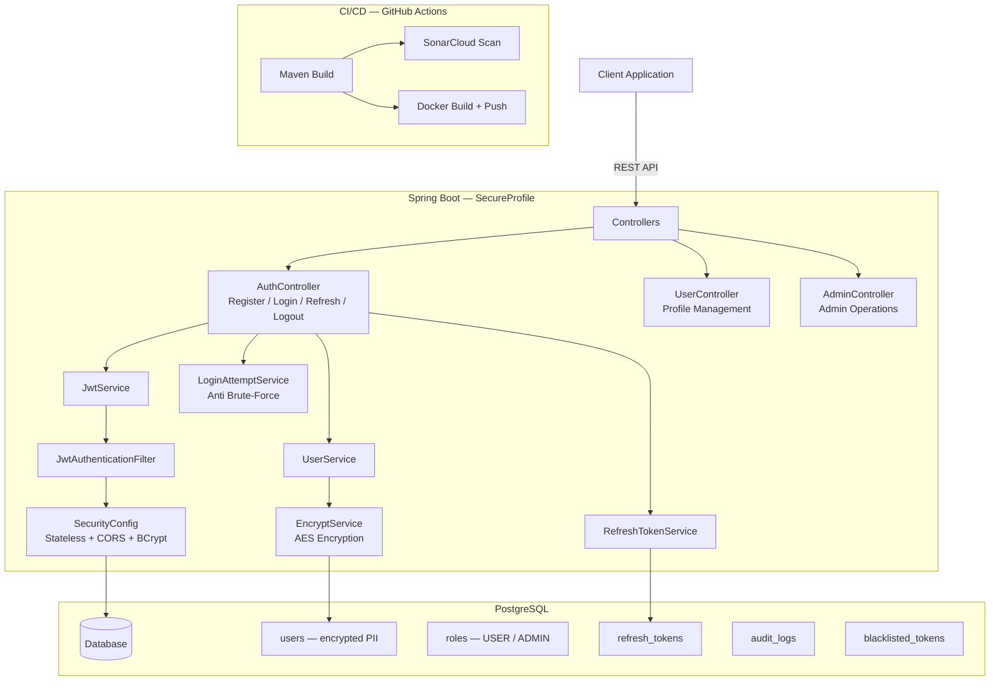

# SecureProfile Backend

> Secure user profile management API built with Spring Boot, implementing encrypted data storage, JWT authentication, role-based access control, and automated CI/CD with SonarCloud analysis.


## Architecture



## Features

- **Encrypted PII storage**: AES encryption for usernames and emails at the service layer
- **JWT dual-token system**: short-lived access tokens + persistent refresh tokens
- **Brute-force protection**: automatic temporary account lockout after failed attempts
- **Strong password enforcement**: custom `@StrongPassword` validator requiring 12+ characters
- **Role-based authorization**: USER and ADMIN roles with endpoint protection
- **Token management**: refresh, revoke on logout, scheduled cleanup of expired tokens
- **Audit trail**: logs security events for compliance
- **CI/CD**: GitHub Actions pipeline with Maven build, SonarCloud scan, and Docker Hub deployment
- **Secure Docker image**: non-root user on Eclipse Temurin 17 Alpine

## Tech Stack

| Category | Technology |
|----------|-----------|
| Language | Java 17 |
| Framework | Spring Boot 3.1.5 |
| Security | Spring Security, JWT (jjwt 0.12.5), BCrypt |
| Database | PostgreSQL |
| ORM | Spring Data JPA |
| Encryption | AES (EncryptService) |
| CI/CD | GitHub Actions |
| Code Quality | SonarCloud |
| Container | Docker (Temurin 17 Alpine) |

## Getting Started

### Prerequisites

- Java 17+
- Maven 3.8+
- PostgreSQL 14+

### Installation

```bash
git clone https://github.com/g-holali-david/secureprofile-backend.git
cd secureprofile-backend

# Set environment variables (.env file)
# DB_HOST, DB_PORT, DB_NAME, DB_USER, DB_PASS
# JWT_SECRET, JWT_ACCESS_EXPIRATION_MS, JWT_REFRESH_EXPIRATION_MS
# ENC_ALGORITHM, ENC_SECRET_KEY

./mvnw clean package
java -jar target/backend-0.0.1-SNAPSHOT.jar
```

### Usage

```bash
# Register
curl -X POST http://localhost:8080/api/v1/auth/register \
  -H "Content-Type: application/json" \
  -d '{"username":"alice","email":"alice@example.com","password":"Str0ngP@ssw0rd!"}'

# Login (returns accessToken + refreshToken)
curl -X POST http://localhost:8080/api/v1/auth/login \
  -H "Content-Type: application/json" \
  -d '{"username":"alice","password":"Str0ngP@ssw0rd!"}'

# Access protected endpoint
curl -H "Authorization: Bearer <accessToken>" http://localhost:8080/api/v1/user/profile

# Docker
docker build -t secureprofile-backend .
docker run -p 8080:8080 --env-file .env secureprofile-backend
```

## Project Structure

```
secureprofile-backend/
├── Dockerfile
├── pom.xml
├── sonar-project.properties
├── .github/workflows/ci.yml
└── src/main/java/ms/secureprofile/backend/
    ├── BackendApplication.java
    ├── controller/
    │   ├── AuthController.java
    │   ├── UserController.java
    │   └── AdminController.java
    ├── model/
    │   ├── User.java
    │   ├── Role.java
    │   ├── RefreshToken.java
    │   ├── AuditLog.java
    │   └── BlacklistedToken.java
    ├── security/
    │   ├── SecurityConfig.java
    │   ├── JwtService.java
    │   ├── JwtAuthenticationFilter.java
    │   ├── EncryptService.java
    │   ├── LoginAttemptService.java
    │   └── UserDetailsServiceImpl.java
    ├── service/
    │   ├── UserService.java
    │   ├── AuditService.java
    │   └── RefreshTokenService.java
    ├── repository/
    ├── validation/
    │   ├── StrongPassword.java
    │   └── StrongPasswordValidator.java
    └── exception/
        └── ValidationExceptionHandler.java
```

## Author

**Holali David GAVI** — Cloud & DevOps Engineer
- Portfolio: [hdgavi.dev](https://hdgavi.dev)
- GitHub: [@g-holali-david](https://github.com/g-holali-david)
- LinkedIn: [Holali David GAVI](https://www.linkedin.com/in/holali-david-g-4a434631a/)

## License

MIT
